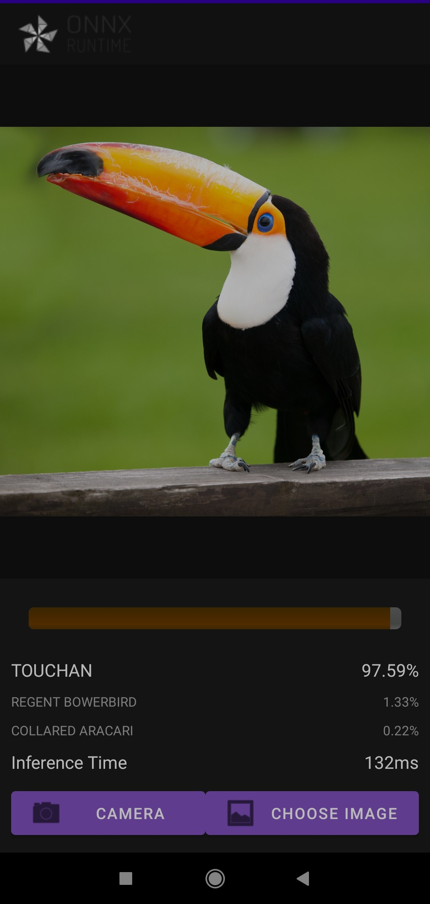
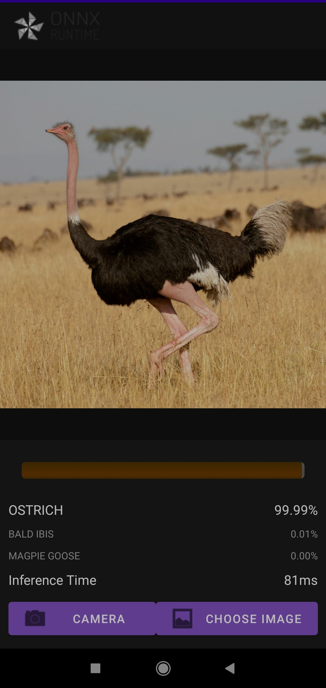

# Android Image Classifier App

<<<<<<< HEAD
This repo is strongly based on https://github.com/microsoft/onnxruntime-inference-examples/tree/main/mobile/examples/image_classification/android.
Follow their steps to build and run the app.

The differences between both repositories are:
- You can pick an image from your gallery in this implementation;
- Quantization option removed.

To use your classifier, you must:

- convert your model to ORT format, rename it to "model.ort" and paste it to `app/src/main/res/raw/`;
- create a txt file named "labels.txt" with your labels at each line at the same order of the prediction index and paste it to `app/src/main/res/raw/`;

You can change the name of your App at `app/src/main/res/values/strings.xml`.

In order to use it in your phone, select **Build** -> **Build Bundle(s) / APK(s)** > **Build APK(s)**. 
The apk file will be located in `project-name/module-name/build/outputs/apk/`.
=======
Strongly based on https://github.com/microsoft/onnxruntime-inference-examples/tree/main/mobile/examples/image_classification/android.
Follow their steps to build and run the app.

The main difference of this repo from theirs is that you can pick a picture from your gallery in this implementation, 
while the quantization option was removed.

To use your own classifier app, you must:

- convert your model to ORT format and paste it to `app/src/main/res/raw/`;
- create a txt file with your labels at each line at the same order of the prediction index and paste it to `app/src/main/res/raw/`.
- go to `app/src/main/java/ai/example/app/Mainactivity.kt` and change lines 286 and 291 to your labels 
file name and your model file name, respectively. You may just rename your labels file to "labels.txt" and your model file to "model.ort".

You can change the name of your App at `app/src/main/res/values/strings.xml`.

In order to use it in your phone, you've to click in **Build** -> **Build Bundle(s) / APK(s)** > **Build APK(s)**. 
The apk file'll be located in `project-name/module-name/build/outputs/apk/`.
>>>>>>> e9d7ca3dd6b69d9dde53cfe340fa70e4d6679598

Example screenshot of a bird species predictor app trained with https://www.kaggle.com/gpiosenka/100-bird-species.

    

